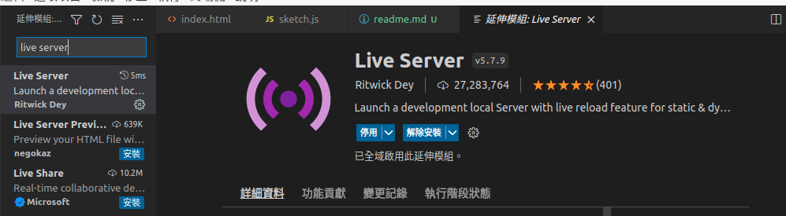

# Demo Video

[Link](https://www.youtube.com/watch?v=s8W9_LCPH84)

# How to run this code

1. 在 VScode 裡面裝Live Server套件

2. 在src資料夾裡面有index.html，點擊右鍵選 "Open with live server"
3. 邏輯code寫在sketch.js裡面

# Notice
記得使用safari瀏覽器開啟
